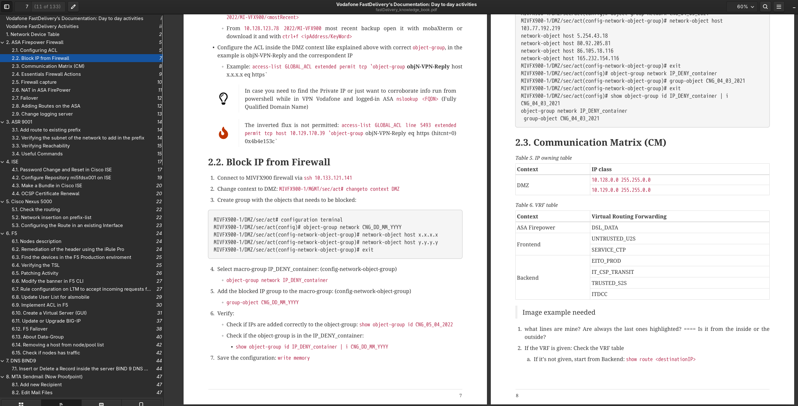

# Technical Documentation & Reference Materials

A showcase of technical documentation approaches and personal reference materials. This repository demonstrates my methodology for creating clear, structured technical documentation across different formats and use cases.

## Overview

This repository serves two purposes:
1. **Portfolio showcase**: Demonstrates documentation skills for potential employers
2. **Personal reference**: Quick-access cheatsheets and wikis for daily work

## Original Documentation

### 📱 ADB Cheatsheet
**Comprehensive Android Debug Bridge reference**

Personal cheatsheet covering ADB commands for Android device management, debugging, and automation tasks. Structured for quick lookup during development and troubleshooting.

- **Format**: Org-mode
- **Use Case**: Mobile device debugging and automation
- **Scope**: Command reference, common workflows, troubleshooting

📖 [View ADB Cheatsheet](adb-cheatsheet.org)

---

### 🏢 Enterprise Telecom Infrastructure Operations
**Internal wiki and operational procedures for telecom networks**

Documentation created for FastDelivery network operations, covering enterprise-scale telecommunications infrastructure. Includes operational procedures, network topology documentation, and troubleshooting guides.

- **Format**: AsciiDoctor, PDF exports
- **Scope**: Multi-vendor network operations, change management, incident response
- **Audience**: Network operations team, system administrators

📖 Files: `EnterpriseTelecomInfrastructuredOperatio...` (PDF exports)  
📖 Images: Visual diagrams and network topology documentation

- 

---

### 📚 FastDelivery Antora Documentation Site
**Structured technical documentation using Antora static site generator**

Demonstrates modern documentation-as-code approach using AsciiDoctor and Antora. Multi-page documentation site covering network operations, procedures, and knowledge base articles.

**Structure:**
- Operational procedures (Canvass activities, instructions)
- Network documentation (changelog, macro documentation)
- Knowledge base (troubleshooting, system admin info)

**Technology Stack:**
- AsciiDoctor for content authoring
- Antora for site generation
- Version-controlled documentation workflow

📖 *Antora site in progress*

---

## Reference Cheatsheets

Quick-reference materials for daily operations:

| Tool | Purpose | Format |
|------|---------|--------|
| **VIM** | Text editor commands and workflows | Markdown |
| **screen** | Terminal multiplexer reference | Markdown |
| **termux** | Android terminal emulator | Org-mode |
| **tmux** | Terminal multiplexer (advanced) | Markdown/AsciiDoctor |

## Documentation Philosophy

My approach to technical documentation:

- **Clarity first**: Write for the person who needs answers quickly
- **Structure matters**: Logical organization beats comprehensive chaos
- **Multiple formats**: Choose the right tool for the audience (Markdown, AsciiDoctor, Org-mode)
- **Living documents**: Documentation should evolve with the systems it describes
- **Visual aids**: Diagrams and images where they add real value

## Formats Used

- **Markdown**: Quick references, cheatsheets, README files
- **AsciiDoctor**: Complex technical documentation, multi-page guides
- **Org-mode**: Personal knowledge management, Emacs workflow integration
- **PDF**: Distribution format for formal documentation

## Tools & Technologies

- **Antora**: Static site generator for asciidoctor versioned documentation
- **AsciiDoctor**: Semantic markup for technical writing
- **Org-mode**: Plain-text knowledge management
- **Git**: Version control for documentation-as-code

## Status

This repository is actively maintained and expanded as I create new reference materials and documentation projects.

## Author

**Gabriele Saronni**  
Network Engineer & Technical Writer

[LinkedIn](https://linkedin.com/in/gabriele-s-54514173) | [GitHub](https://github.com/gsaronni)

---

*Documentation created from real operational experience in enterprise telecommunications and network engineering.*
